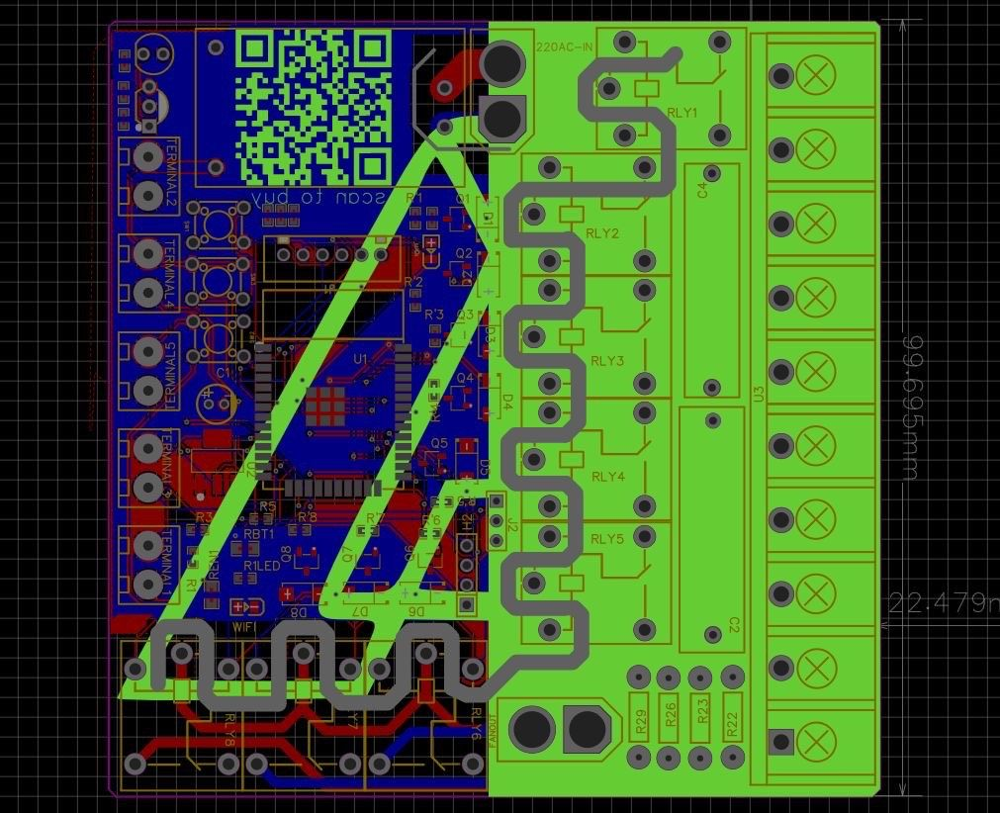
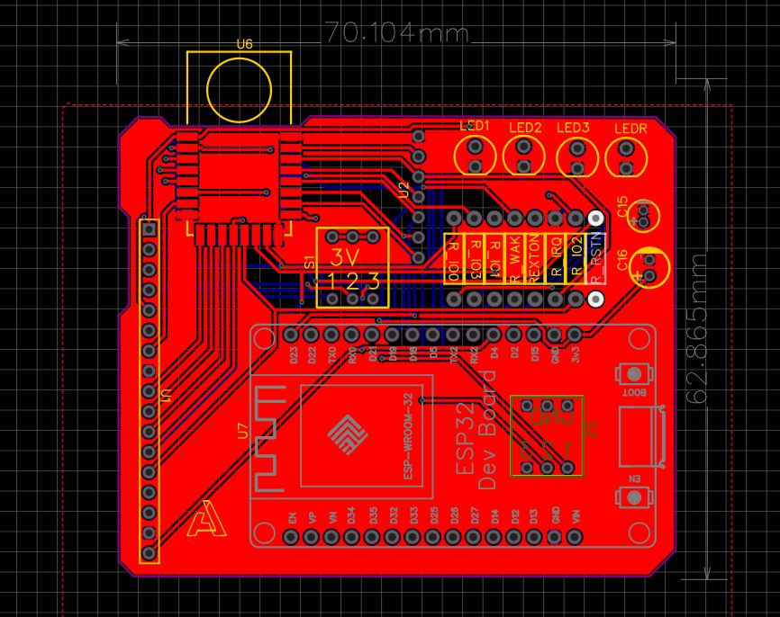
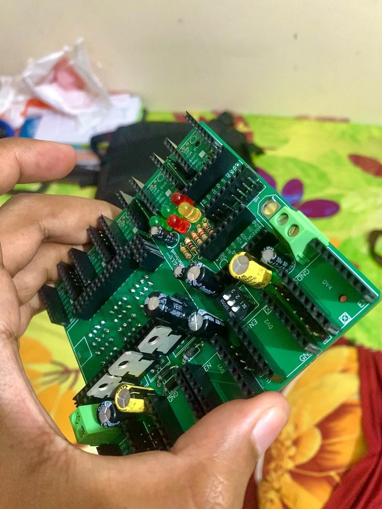
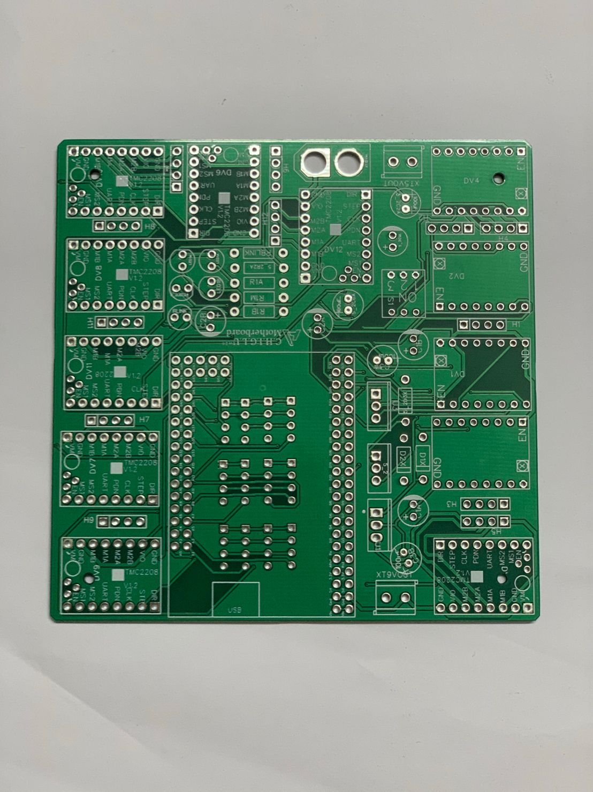

# PCB Design and Fabrication Portfolio (Updating, And Currently learning Hi-speed PCB Design )
This portfolio showcases my previous work in PCB design and fabrication. It includes pictures of various PCBs that I have designed and fabricated using PCB Designing tools.

## Projects
This portfolio includes pictures of the following PCBs that I have designed and fabricated:

- Home Automation PCB
- Motor driver circuit
- UWB Based Circuit Board
- ATtint Ultra Low powered 7-segment LED clock
- And more!
- Highspeed PCB Design Commming Sooonnnnnn!!!!!!!
  
## Research Article (latest inclusion: Year 2025)
Read my article where I've used Clever design practices and how I optimize the Power Density Across the Board: 
> [1] A. Shahriar, Anik, M. H. (2025). CHIGLU: A Modular Hardware for Stepper Motorized Quadruped Robot—Design Approach and Analysis. *MethodsX*, 103270. [https://doi.org/10.1016/j.mex.2025.103270](https://doi.org/10.1016/j.mex.2025.103270) 

## Skills
My skills in PCB design and fabrication include:

- Designing and routing PCBs, transitioning progressively to Altium.
- Knowledge of PCB layout design principles
- Creating custom footprints for components
- Generating Gerber files for fabrication
- Selecting appropriate components and connectors for specific applications
- Soldering and assembling PCBs
- Familiarity with various fabrication techniques such as SMT and through-hole assembly
- Design for Manufacturing

## PDN Analyzer Simulation (NEW !!!!)

| Voltage Drop Analysis (Click to play)| Current Density Analysis (Click to play) |
| :---------------------:|:------------------------:|
|  |  |

## Pictures
Here are the pictures of my previous PCB design and fabrication work:

<!-- START IMAGES -->
|  |  |  |  |  |
| ------- | ------- | ------- | ------- | ------- |
|  |  |  |  |  |
|  |  |  |  |  |
|  |  |  |  |  |
|  |

## Contact
Please feel free to contact me.

Email: **abidshahriar97@gmail.com**

